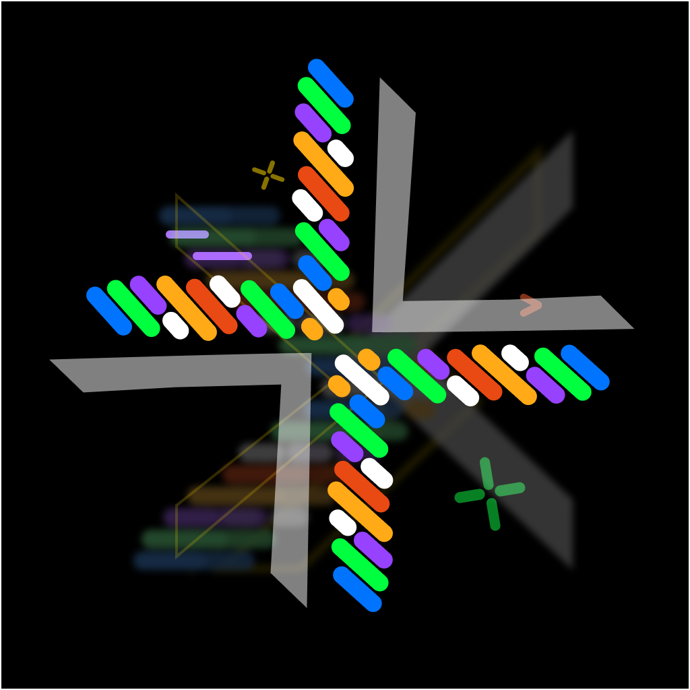
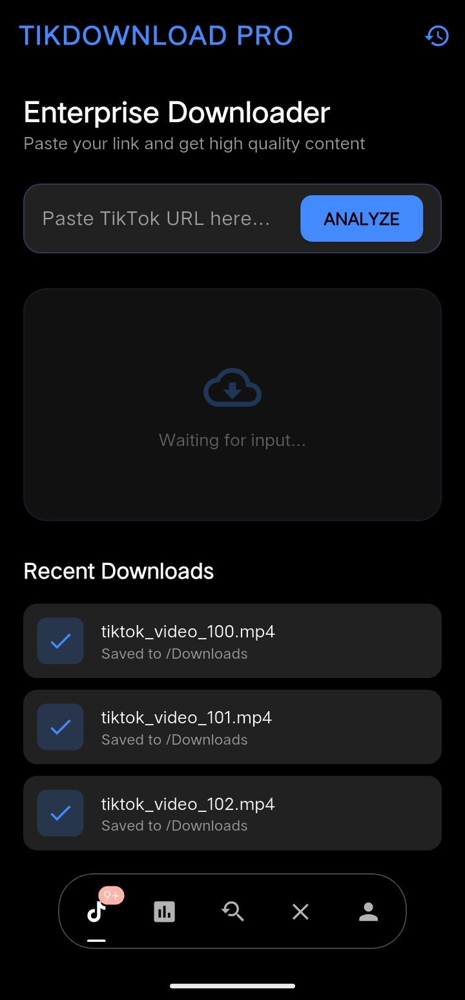
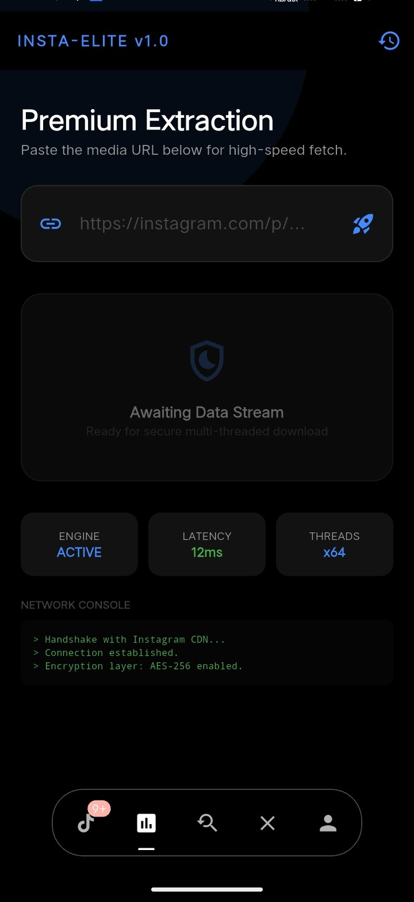
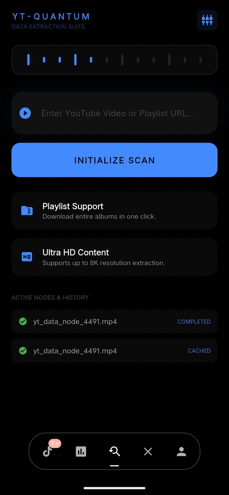
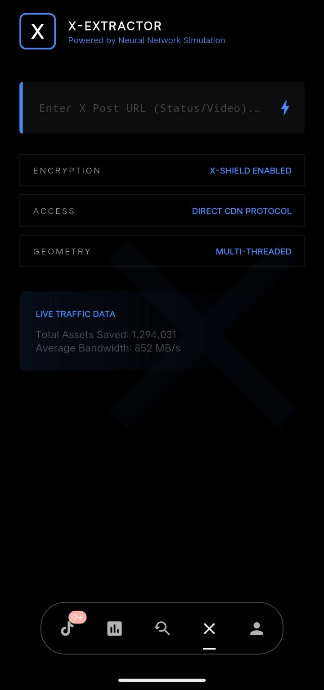

<center>
    <picture>
    <source
        width="50%"
        srcset="./docs/media/AnySynx.png"
        media="(prefers-color-scheme: dark)"
    />
    <source
        width="50%"
        srcset="./docs/media/AnySynx.png"
        media="(prefers-color-scheme: light), (prefers-color-scheme: no-preference)"
    />
    
    </picture>
</center>

<h1 align="center">AnySynx ( WIP )</h1>

<p align="center">This application was built to provide fast and efficient access to download content from various platforms without the obstacles of advertising or subscription fees. ( Hasil vibe coder jir 😂 )</p>

<p align="center">
  [<a href="https://github.com/SyntxFlow/AnySynx/releases">Try it</a>]
</p>

<p align="center">
  <a href="https://github.com/moeru-ai/airi/blob/main/LICENSE"></a>
  <a href="https://discord.gg/fUusrraZ"></a>
  <a href="https://github.com/SyntxFlow"></a>
</p>

> [!NOTE]
> This application is currently under active **development**. At the moment, only the user interface (UI) is available as an early preview of the design and overall user experience.
> 
> Core features and functionalities have not been implemented yet and will be added gradually in future **updates**. Feedback, suggestions, and ideas are highly appreciated to help improve and shape this application moving forward.
>
> Thank you for your support and patience

## Preview

<div style="display: flex; flex-wrap: wrap; gap: 16px;">
  
  
  
  
</div>

## Current Progress

- [ ] UI 
  - [x] Tiktok
  - [ ] Youtube
  - [ ] X
  - [ ] Instagram

## Development

```shell
cd App
flutter pub get
```

### Start dev

```shell
flutter run
```

### Build APK ( Split per abi )

```shell
flutter build apk --release --split-per-abi
```

## Star History

[](https://www.star-history.com/#SyntxFlow/AnySynx&Date)